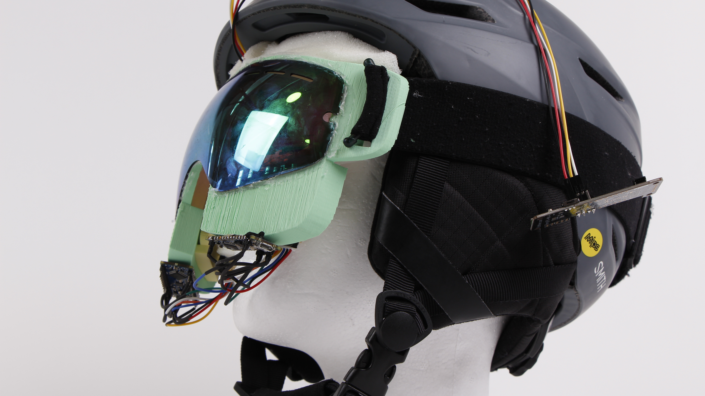
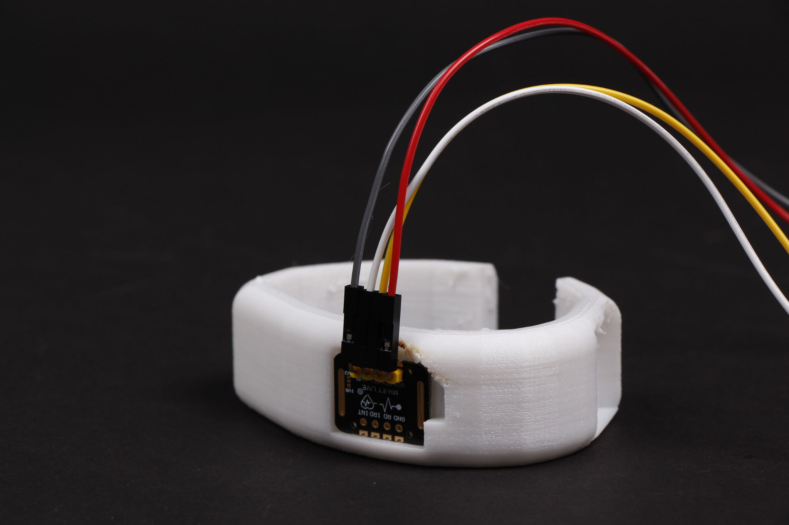
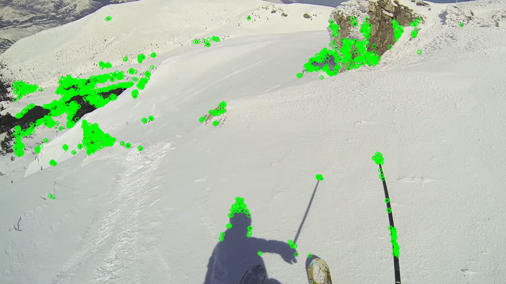
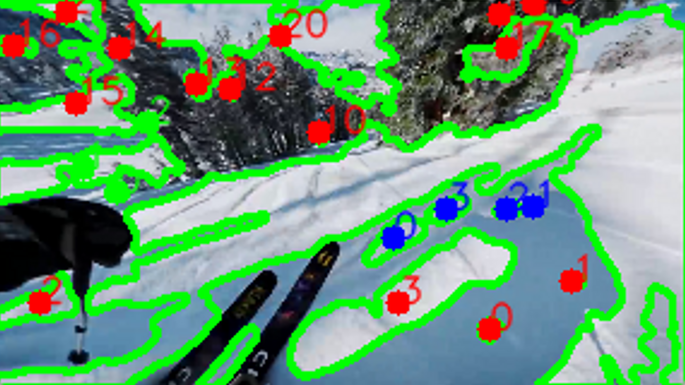
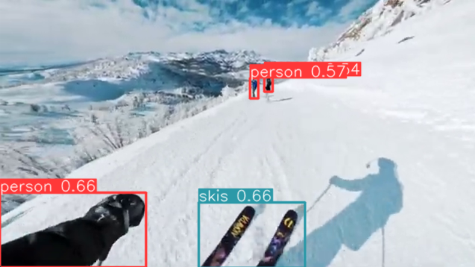
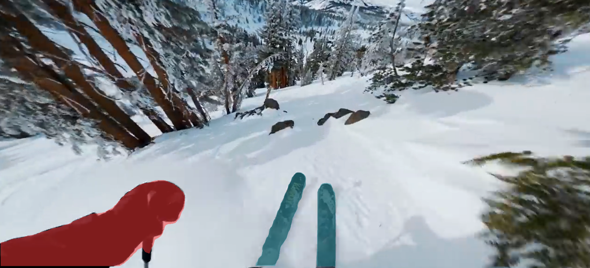
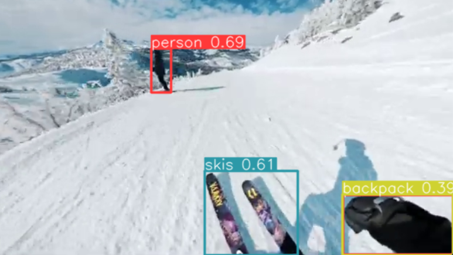
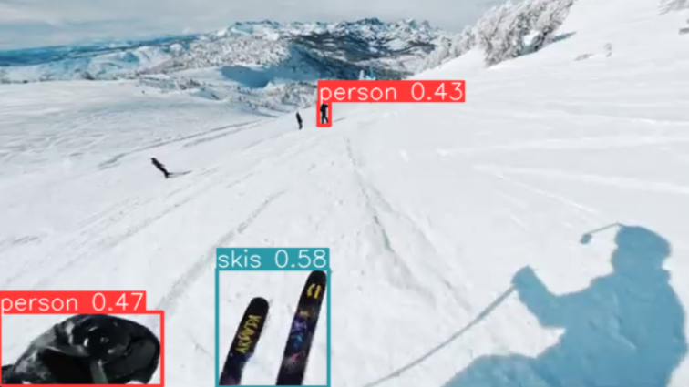
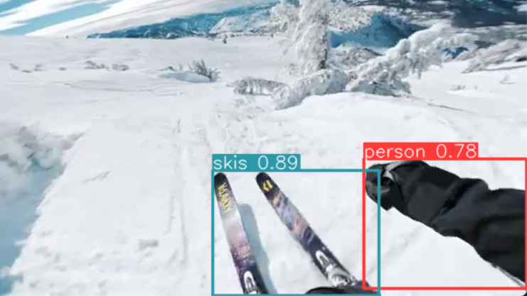
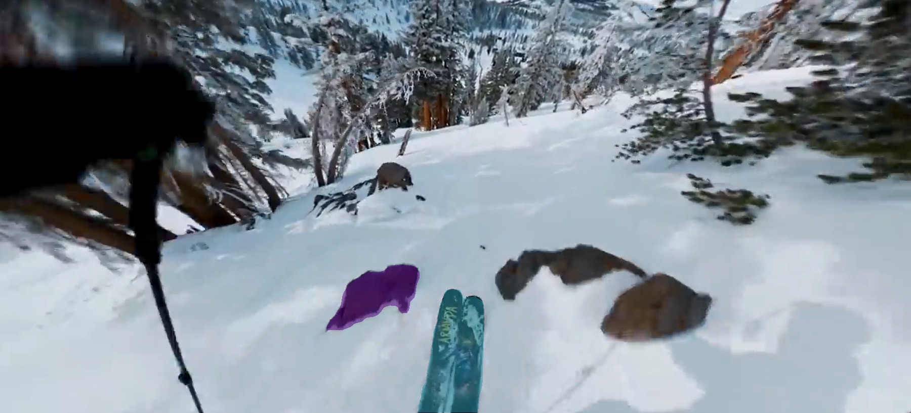

# SkiHUD Spring OI 2023

[Project Page](https://cambridge.nuvustudio.com/projects/100559-skihud)

[Mid Review Presentation](https://cambridge.nuvustudio.com/posts/837167-mid-review)

## Thesis Statements

SkiHud is a combination of technologies including a heart rate sensor wristband to be given to a patient, a compass and computer recognition looking for crossed skies. Clients mention fear of missing identifiers of an injured skier, SkiHud solves this issue.

SkiHUD enhances the capabilities of ski patrol by automatically tagging indicators of a skiing accident, allowing the patroller to monitor the injured persons vitals, and assisting with large scale search patterns and navigation.

## Precedents

## Progression

## Examples

